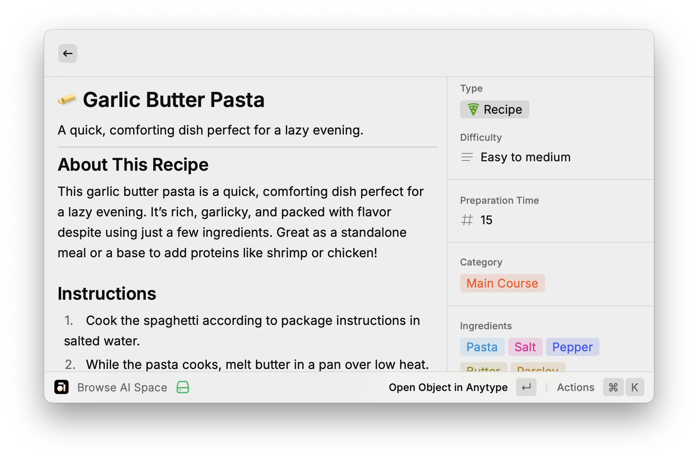
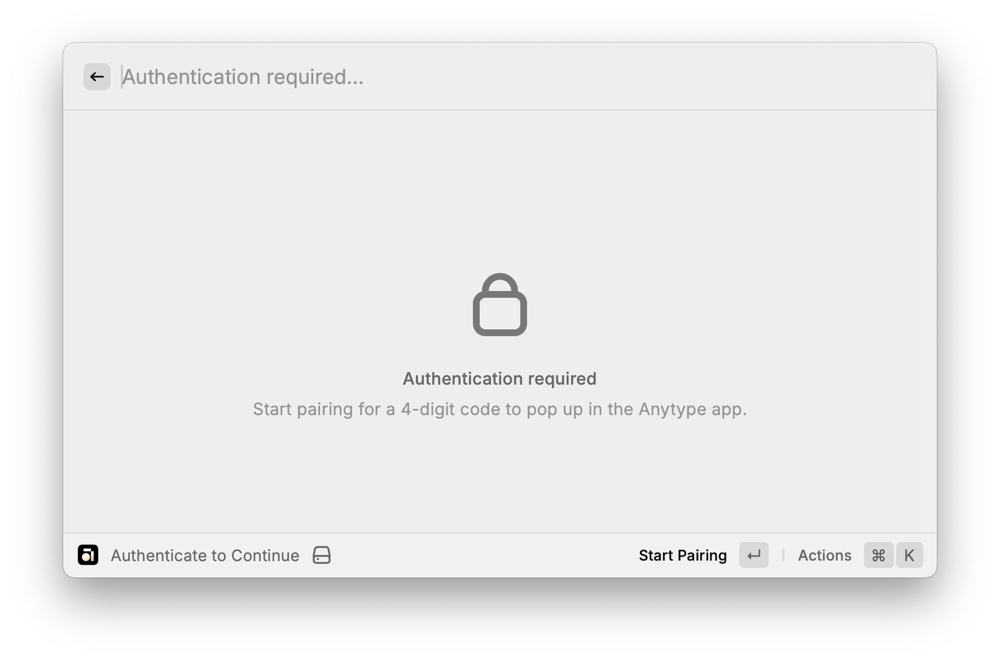
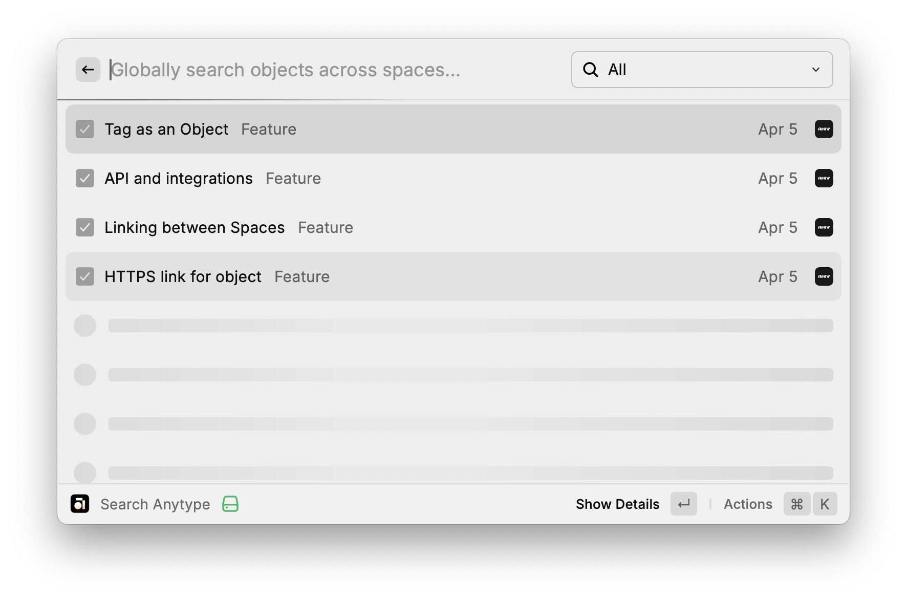
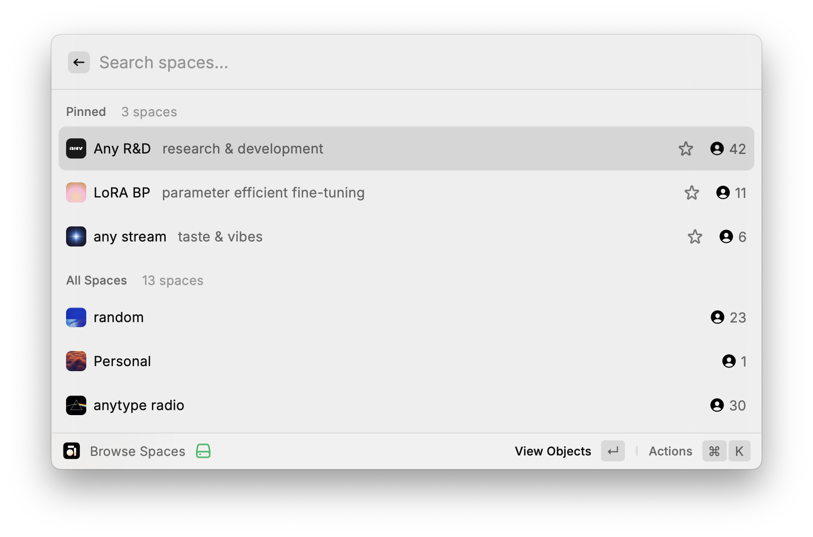
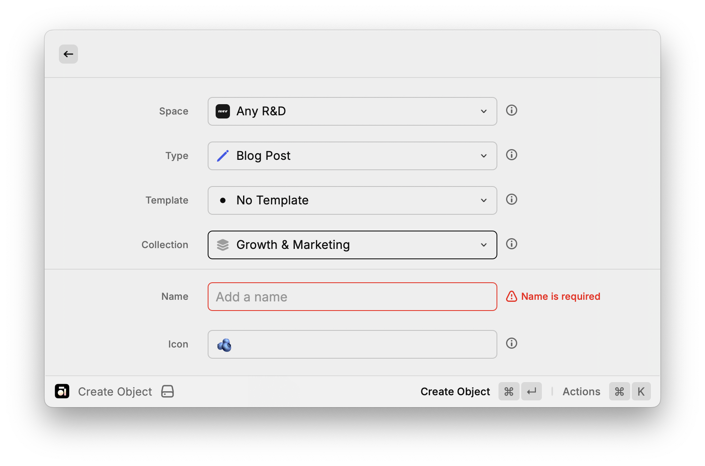
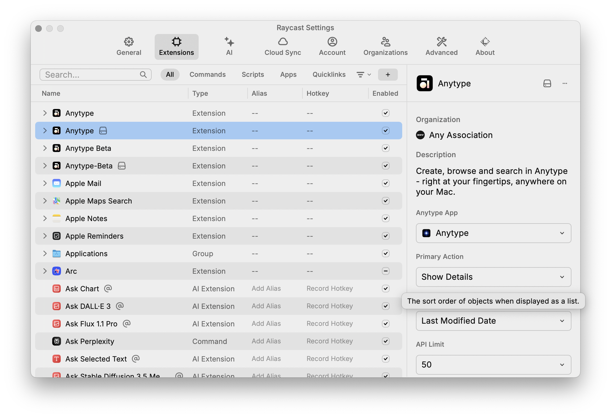
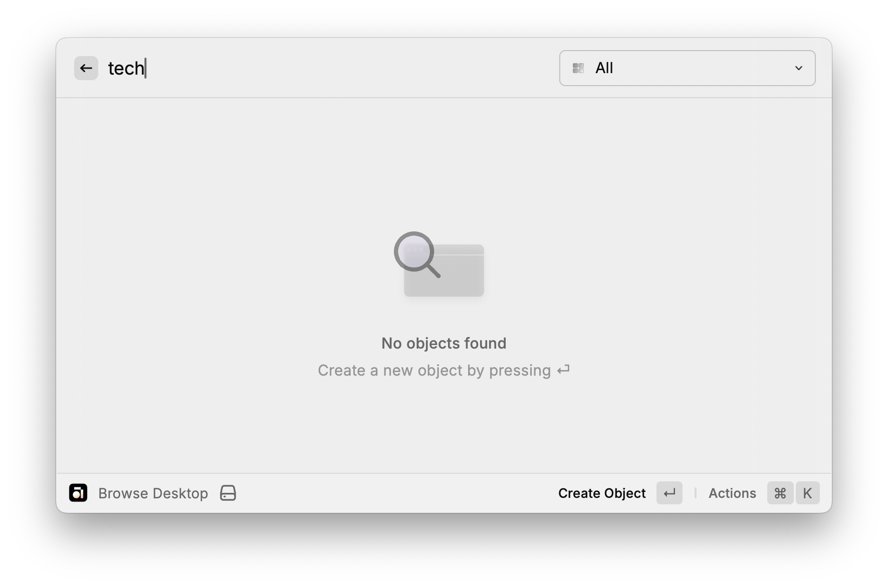
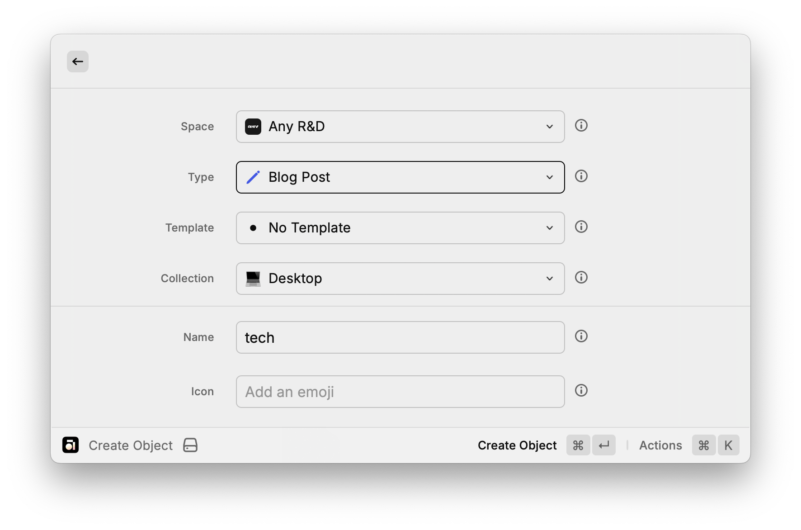
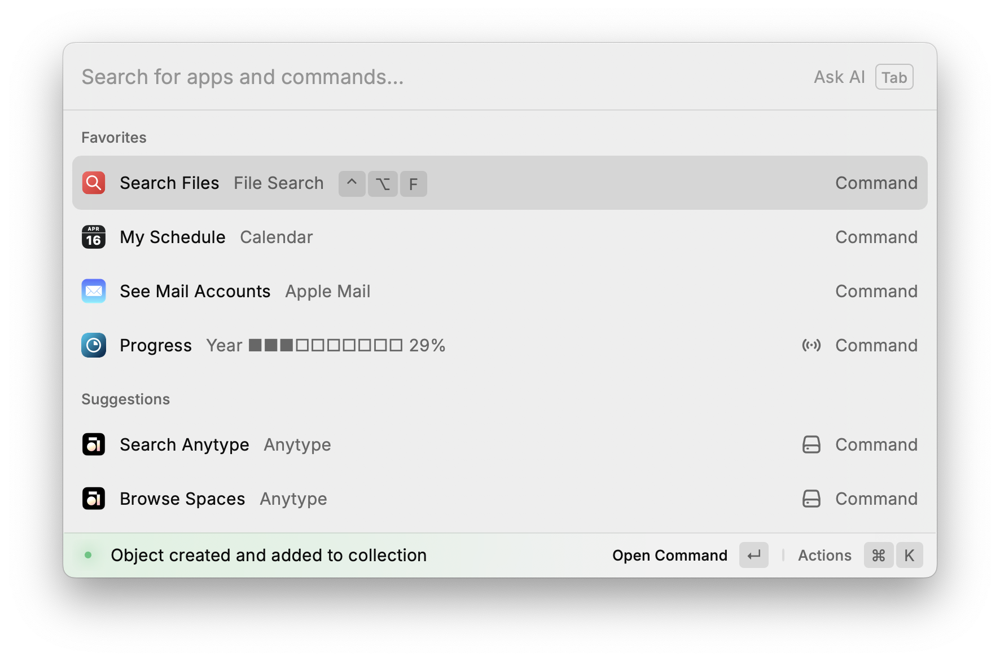

import styles from "../../../src/examples/index.css";

# Anytype for Raycast

## Overview

The Anytype Raycast extension is a typescript client that brings the Anytype experience into the Raycast launcher. It lets users **create, browse, and search Anytype objects** directly from Raycast. Under the hood, the extension communicates with the Anytype desktop app via a local API, manages state with React hooks, and follows Raycast’s guidelines for UI and performance. This write-up provides a deep dive into the extension’s architecture and implementation, highlighting key decisions and patterns used to build a feature-rich API client in Raycast.

<div style={{ display: "flex", alignItems: "center", justifyContent: "space-between", flexWrap: "wrap" }}>
  Find the extension's repository on [Github](https://github.com/anyproto/anytype-raycast), and install it from Raycast's store:
  <a title="Install anytype Raycast Extension" href="https://www.raycast.com/any/anytype">
    
  </a>
</div>



<span className="imageCaption">Detail View in Raycast: Object body, with properties in right sidebar.</span>

## Authentication & Pairing Flow

Anytype’s API is secured, so the extension must authenticate with the running Anytype app. The extension uses a **local pairing flow** for authentication:

- **Pairing Process:** When the extension is first used (or if the token is missing/invalid), it prompts the user to authenticate. The `EnsureAuthenticated` component intercepts commands and displays a special UI. The user is asked to start a pairing, which triggers Anytype to show a **4-digit code** for verification. The extension calls the Anytype API to initiate this challenge and receives a `challenge_id` for the session. A toast notification informs the user that pairing has started and to check the Anytype app for the code.
- **Entering the Code:** The extension then shows a form for the user to input the 4-digit code from Anytype. Upon submission, the extension calls the API with the challenge_id and code to retrieve an app_key (token). On success, this token is stored securely (using Raycast’s LocalStorage) for future API calls, and a success toast confirms the extension is now paired. If the code is incorrect or pairing fails, an error toast notifies the user of the failure.
- **Token Storage & Validation:** The first time the extension runs, it checks if a saved token exists and validates it by making a trivial API call (e.g. `getSpaces with a small limit). If the token is valid (or if the only error is that the Anytype app is not reachable), the extension proceeds. This check also compares API versions between the extension and Anytype; if there’s a mismatch, the extension shows a clear toast instructing the user to update the app or extension. This ensures the client and server are using compatible API versions.
- **EnsureAuthenticated Wrapper:** All top-level commands (Create, Browse, Search) are wrapped in an `EnsureAuthenticated` component that implements the above logic. If a valid token is present, it simply renders the child component (the actual command UI). If not, it displays a locking screen with a call to action to start pairing. This pattern centralizes auth logic and keeps the rest of the codebase focused on functionality.

**Why this strategy?** Using a local pairing flow avoids storing user credentials or long-lived tokens externally. By leveraging Anytype’s app for the authentication UI (the code display) and a short token exchange, the extension stays secure and user-friendly. The flow also handles edge cases: it has built-in prompts to launch the Anytype app or download it if not running, and robust validation to prevent proceeding with an expired or incompatible token.



<span className="imageCaption">Pairing Process: Prompting the user to authenticate with the Anytype app.</span>

## Data Fetching & Pagination

Once authenticated, the extension fetches data from the Anytype API for various domains: **spaces**, **objects**, **lists**, **types**, and **members**. The architecture relies on Raycast’s asynchronous data utilities to handle **pagination** and **loading states** seamlessly:

- **useCachedPromise:** The extension uses Raycast’s `useCachedPromise` hook to fetch data with caching and pagination support. For example, the `useSpaces()` hook fetches a page of spaces from the API. It defines an async function that takes a page parameter, calculates an `offset`, and calls the corresponding API endpoint (getSpaces) with a limit. The function returns an object with data (the fetched items) and a boolean hasMore flag indicating if more pages are available. Raycast uses this to handle infinite scrolling in lists. Similar hooks exist for objects (useObjects), members (useMembers), types (useTypes), and objects within a list (useObjectsInList), each tailoring the API call to its domain.
- **Pagination in UI:** The Raycast component is given the pagination object returned by these hooks. For instance, the global search command uses `<List pagination={objectsPagination} ...>` so that scrolling triggers loading more results. The hooks also filter out any null or empty entries from results as a guard against transient API issues (preventing UI flickers with undefined items).
- **Offset and Limits:** By default, the extension fetches items in chunks defined by an apiLimit preference. This is configurable by the user (see **Preferences** below) but defaults to a reasonable number for performance. Internally, the hooks compute `offset = page * limit` and request that slice of data. The Anytype API responses include a pagination object with has_more and total counts, which the extension uses to know when to stop fetching further pages.
- **Batch and Conditional Fetching:** For certain data, the extension employs specialized fetching strategies. For example, in the **Browse Spaces** view, after loading the list of spaces, it kicks off parallel requests to fetch the member count for each space (using a small page size of 1 just to get the total count from pagination metadata). These run in a `Promise.all` to populate member counts without blocking the main UI. This design choice provides additional context (number of members per space) in the list view with minimal delay. All such background fetches have error handling – e.g. if fetching member counts fails, a toast alerts the user but the spaces list still displays.

By leveraging `useCachedPromise` and careful pagination logic, the extension efficiently handles potentially large data sets (many objects or members) while keeping the Raycast UI responsive. Developers can adapt this pattern for their own clients: define a hook per resource that returns data and pagination, and feed that into the client's list component for automatic continuous scroll behavior.



<span className="imageCaption">Paginated Data Fetching: Loading more results as the user scrolls.</span>

## Caching & State Management with Hooks

Handling state in a Raycast extension is a bit different from a typical web app. This extension uses a mix of **React hooks for transient state**, **Raycast’s local storage for persistent state**, and **Context values** passed between components:

- **React Local State:** For dynamic UI state, such as search query text, filter selections, or currently viewed section, the extension uses React’s `useState` hooks. In the global search component, for example, it maintains `searchText`, the selected filter `currentView` (to toggle between All, Pages, Tasks, etc.), and even caches of space icons in state. These state variables drive what query is sent to the API and how results are filtered or displayed (e.g., switching the currentView changes the filter for object types). The state is local to the component and resets when the command is closed, which is appropriate for ephemeral data like the current search or selection.
- **Persistent Cache (LocalStorage):** For data that should persist across sessions, such as authentication tokens and user-defined pinned items, the extension uses Raycast’s `LocalStorage` API. The `EnsureAuthenticated` component stores the obtained `app_key` token in local storage once pairing is successful. Similarly, when a user pins a space or object for quick access, that pin is saved. The extension implements helper utilities `getPinned` and `addPinned` to manage these lists in local storage (namespaced by a key). On startup of relevant views, hooks like `usePinnedObjects` or `usePinnedSpaces` retrieve these persisted IDs and then fetch fresh data for each pinned item to ensure they’re up-to-date. If a pinned object is not found (e.g., it was deleted or archived in Anytype), the code catches the 404/410 response and automatically removes that item from the pinned list. This way, pinned shortcuts never linger as broken links – the extension self-heals by cleaning invalid pins.
- **Derived State via Hooks:** The extension also uses custom hooks to encapsulate complex stateful logic. A prime example is `useCreateObjectData`, which gathers all necessary data for the "Create Object" form (like available spaces, types, templates, etc.) and manages the selection state of each. This hook returns state variables like `selectedSpace`, `selectedType`, etc., and setter functions to update them. It abstracts away the logic of loading all spaces or types and filtering out unwanted ones (like system object types that shouldn’t be shown) so that the UI component can just consume the ready-to-use lists. Hooks like this often use multiple other hooks inside (for data fetching, etc.) and combine their results.
- **Context and Draft Values:** When navigating between views (for example, from an empty search result to the create form), the extension passes along **context values** to prefill the form. Raycast’s navigation allows sending `launchContext` or initial props; the extension uses a `draftValues` object (of type `CreateObjectFormValues`) to carry state between components. For instance, the search command’s empty state passes `{ name: searchText }` as context to the create form (meaning "treat the search text as the name of the new object"). This context is merged with any existing draft values and used by `useCreateObjectData` to initialize the form state. This pattern ensures a smooth experience: data flows through hooks and context rather than being stored in some global variable.

In summary, the extension caches server data when appropriate (using Raycast caching and local storage) and uses React state for UI responsiveness. By carefully separating persistent state (like pins and auth) from transient state (like input text), it achieves both **performance** and **consistency**. Developers can emulate this by deciding which data needs to persist (store it via client's local storage) and which can be ephemeral, and by using custom hooks to encapsulate related state and side-effects.



<span className="imageCaption">Local Storage for Pinned Spaces: Storing user preferences and pinned items.</span>

## Error Handling & User Feedback

Robust error handling is crucial in a productivity tool – users should be informed of issues and guided on how to resolve them. The Anytype extension employs multiple layers of error handling, with clear **toast notifications**, graceful fallbacks, and informative empty states:

- **API Connectivity Issues:** If the extension cannot reach the Anytype API (e.g., the app is closed or not on the expected port), the fetch utilities throw a specific error message "Can't connect to API. Please ensure Anytype is running and reachable.". The authentication guard (`EnsureAuthenticated`) interprets this as a special case: it doesn’t treat it as a token failure, allowing the UI to load and then show a relevant message elsewhere. Additionally, when a connection error is detected during token validation, the extension returns true (assuming the token is fine, just not reachable), meaning it proceeds as "authenticated" and lets the commands themselves still show previously cached data. In practice, if you open a command while Anytype is off, you’ll see a toast with the connection error message whenever a data fetch fails, prompting you to launch the app.
- **Data Fetch Errors:** Each data-loading hook and component includes error handling. For instance, the Spaces list monitors `spacesError` from the `useSpaces` hook and triggers a failure toast if it’s non-null. This pattern repeats for other resources (types, templates, lists, etc.) – on any error, a toast appears with a generic "Failed to fetch …" message and the actual error text (often originating from the API). By consolidating this in a useEffect listening to error state, the UI doesn’t break; it simply shows whatever partial data is available (if any) and alerts the user. In many cases, even if one resource fails, others might succeed (e.g., spaces loaded but members count failed) – the extension prefers to show what it can rather than nothing at all.
- **Input Validation & Feedback:** During forms (like pairing or creating an object), validation rules are provided to catch issues early. For example, the pairing code form validates that the input is exactly 4 digits, giving an inline error if not. If the user tries to submit before starting the pairing challenge, the code checks `challengeId` and shows a failure toast instructing to start pairing first. Similarly, when creating objects or spaces, required fields are validated in the Raycast form config (e.g., space name cannot be empty), and errors are shown to the user immediately instead of making a failing API call.
- **Success and Action Feedback:** Positive actions are confirmed with toasts as well. Copying an object’s deep link to clipboard triggers a success toast: "Link copied". Deleting an object shows a success message including the object’s title once done. These small cues reassure the user that the command was received and processed. The extension uses `Toast.Style.Success` and `Toast.Style.Failure` consistently to differentiate outcomes. It also leverages Raycast’s `showToast` capabilities such as `primaryAction` on the toast – for example, if starting the pairing fails because Anytype isn’t running, the error toast suggests opening Anytype (and even provides a one-click action to do so) , as well as an option to download the app if it’s not installed.
- **Empty States with Actions:** Rather than showing a blank screen when a list is empty, the extension uses **Empty States** to guide the user. Raycast’s `<List.EmptyView>` is utilized to display a message and suggest next steps. For instance, if no spaces match the search query in the "Browse Spaces" view, the list shows _"No spaces found"_ with a prompt that the user can press ⏎ (Enter) to create a new space. Under the hood, this is implemented by a component `EmptyViewSpace` that provides an action to open the "Create Space" form, carrying over the attempted name as a draft. The same concept is applied to object lists: _"No objects found"_ can prompt creating a new object. These empty state components improve UX by turning a dead-end into a shortcut for a useful action.

Overall, the extension strives to never leave the user guessing. Whether through a quick toast or an interactive empty state, it provides **immediate feedback** and often a path to resolve the issue (open the app, try again, insert a name, etc.). This approach can serve as a blueprint: always catch errors from API calls, validate inputs, use toasts and UI elements to communicate, and anticipate scenarios like offline or outdated versions proactively.



<span className="imageCaption">Input Validation: Ensuring the user enters required information correctly.</span>

## Preferences & Configuration

To make the extension flexible for power users, a set of **preferences** is exposed in Raycast’s configuration for the extension. These preferences allow users (and developers testing the extension) to tweak how data is fetched and displayed. Key preferences include:

- **Result Limit:** The number of items fetched per page is controlled by a preference (`limit`). By default this might be a value like 50 or 100. The extension reads this at runtime and uses it as the `apiLimit` for all paginated requests. Advanced users could increase this limit (up to a maximum capped in code, e.g. 1000) if they want to load more items at once, or decrease it to improve performance on slower machines. The code ensures that even if the user sets a very high limit, Raycast’s UI can handle it (through pagination) and the backend is not overwhelmed beyond what Anytype allows.
- **Default Sorting:** Anytype objects can be sorted by different properties (e.g., last modified date, created date, name, etc.). The extension provides a **Sort** preference that the user can set (for instance, _Last Modified_ vs _Name_). This preference is fetched via `getPreferenceValues()` and used to determine ordering of results and the labeling of sections. For example, the section title in global search toggles between "Recent" and "Alphabetical" contextually, and the sort direction is set accordingly (Name sorting uses ascending A→Z, whereas date-based sorting uses descending to show newest first). In the implementation, if the sort is set to "Name", the extension flips the sort direction to ascending; for any date-based sort, it defaults to descending (most recent first). This logic is applied uniformly in search and browse commands so that the user’s preference reflects everywhere.
- **Primary Action (Link Behavior):** Perhaps the most noticeable preference is _Link Behavior_, labeled in code as `primaryAction`. This setting defines what happens when the user selects (hits Enter on) an Anytype object in Raycast. The two primary options are: **Show Details in Raycast** vs **Open in Anytype**. If the user prefers Raycast’s quick view, the extension will show an in-extension detail view of the object. If they prefer to jump into the full Anytype app, the extension will instead launch Anytype via a deep link (`anytype://object?...`). The implementation uses the `primaryAction` value to swap actions in the result list. It pre-defines two actions – one to push a detailed view, and one to open the Anytype app – and chooses which one to make the default (first) action based on the setting. The second option is still available via the action panel (e.g., as a secondary action), so both are accessible at any time, but the preference decides which is on the "top" for a faster workflow. Under the hood, Raycast’s is constructed with something like:

```typescript
const firstPrimaryAction = primaryAction === "show_details" ? showDetailsAction : openObjectAction;
const secondPrimaryAction = primaryAction === "show_details" ? openObjectAction : showDetailsAction;
```

- and then those are added in order. This elegant approach means we don’t duplicate the entire action panel logic – just compute and re-order references.
- **Anytype App Path:** In cases where the Anytype app isn’t in the standard location or if multiple versions exist, the extension offers a preference to specify the path to the Anytype application. This is used when the extension needs to programmatically launch the app (for example, if the user clicks "Open Anytype" during the pairing flow). By default, the extension tries a sensible default path, but this preference allows manual override.

The preferences are defined in the extension’s metadata and are accessed via `getPreferenceValues()` throughout the code. Because Raycast makes preferences reactive (changes take effect on next command invocation), the extension reads these values at runtime rather than hard-coding constants. This design lets developers and users fine-tune the extension’s behavior without altering code.



<span className="imageCaption">Extension Settings: User-configurable preferences for the extension.</span>

## Example Recipe: Creating and Prefilling a New Object from an Empty Search

One of the powerful features of the Anytype extension is the ability to **quickly create a new object when a search comes up empty**. This turns a "no results" scenario into an opportunity to populate your vault. Let’s walk through how this is implemented, step by step, as a cookbook-style recipe.

**Scenario:** The user invokes the "Search Anytype" command in Raycast and types a search term (for example, a project name or note title). The extension searches across all spaces and object types. If it finds nothing matching the query, it will allow the user to create a new object with that query as the starting point.

### 1. Detecting an Empty Search

In the Search Anytype command component, after attempting to load results and pinned items, the extension checks if there are any objects to show. This is done in the JSX return of the component. If the list of results is empty, instead of returning nothing, the component returns an `<EmptyViewObject>` element :

```typescript
{results.length > 0 ? (
    /* ... render results ... */
) : (
    <EmptyViewObject
       title="No objects found"
       contextValues={{ name: searchText }}
    />
)}

```

Here, `searchText` is the user’s query. By providing it in contextValues (specifically as the name field), we pass the information that "if a new object is created, it should have this name" - at least initially. The same context logic applies to pre-selected space, type or collection, if the user searches in a specific space or list.

### 2. The Empty View Component

`EmptyViewObject` is a small wrapper that renders a friendly message and prepares the create-object action. It shows a message like "No objects found" and a description "Create a new object by pressing ⏎". More importantly, it defines what happens on that ⏎. Inside `EmptyViewObject`, the code looks like this:

```typescript
<List.EmptyView
  title={title}
  description="Create a new object by pressing ⏎"
  actions={
    <ActionPanel>
      <Action.Push title="Create Object" target={<CreateObjectForm draftValues={draftValues} />} icon={Icon.Plus} />
    </ActionPanel>
  }
/>
```

This is exactly what the extension does. When the user presses Enter on this empty view, it **pushes a Create Object form onto the navigation stack**, with the `draftValues` passed along. The `draftValues` are derived from the `contextValues` we provided earlier. In our case, `draftValues` will contain at least a name property (and possibly default space or type if the context knows it). The `EmptyViewObject` component ensures all expected fields exist in `draftValues` – if some context is not provided, it initializes them to undefined but keeps the object shape (space, type, list, etc.). This ensures the create form receives a complete object for its uncontrolled state.

**Note:** The use of `<Action.Push>` here is key. It means the extension is not starting a whole new command, but simply navigating within the Raycast extension UI to a new view. The user will see the "Create Object" form slide in, with their search query prefilled.



<span className="imageCaption">Empty View: Offering the user a way to create a new object when no results are found.</span>

### 3. Prefilling the Create Form

When the `CreateObjectForm` component mounts as a result of this navigation, it reads the `draftValues` passed to it. The form is implemented using Raycast’s form APIs (with text fields, dropdowns, etc. for object properties). The provided draft values populate the corresponding fields. For example, the "Name" field of the new object will already have the search text filled in. The code that handles merging draft values is in the `CreateObject` command logic:

```typescript
const mergedValues = { ...launchContext?.defaults, ...draftValues };
const { spaces, types, templates, lists, selectedSpace, selectedType, ... } = useCreateObjectData(mergedValues);
...
<CreateObjectForm
    spaces={spaces} types={types} templates={templates} lists={lists}
    selectedSpace={selectedSpace} setSelectedSpace={setSelectedSpace}
    ...
    draftValues={mergedValues}
    enableDrafts={true}
/>

```

The `mergedValues` line merges any `launchContext.defaults` (which could come from created quicklinks) with our `draftValues`, giving precedence to `draftValues`. In the empty search case, `launchContext` is not used, so `mergedValues` is effectively just our `{ name: "...user query..." }`. This is passed into `useCreateObjectData` which will immediately load the necessary supporting data (like the list of spaces and object types) and pick defaults for space/type if not specified. Notably, if only the name is provided, the extension will auto-select the first space and first object type as defaults so that the form is ready to submit with minimal input.
The form component (CreateObjectForm) receives `draftValues={mergedValues}`, which the text fields use as initial values. `enableDrafts={true}` allows Raycast to preserve the form state if the user navigates away and back (not strictly needed for this flow, but useful in general if the user accidentally closes the form).



<span className="imageCaption">
  Prefilling Create Form: The form is prefilled with the search query as the object name and selected list as collection.
</span>

### 4. Creating the Object

With the form prefilled, the user can adjust any other fields (pick a different space or type, add a description, etc.) or just hit **Cmd+Enter** to create the object. The form’s submit handler will call the Anytype API to create a new object with all the collected fields. Since the extension already loaded the required context (like space and type IDs), it can call the correct endpoint immediately. On success, a toast appears confirming the object creation, and the extension navigates back or closes the form (often using `popToRoot()` to return to the main list) – this detail is handled inside the form’s implementation.
If the user had started from an empty search and created an object, they’ll typically see that new object appear in search results immediately (if the search query still matches the name) or they can find it in the relevant space.

**Why is this useful?** From a UX standpoint, this feature saves time – the user doesn’t have to realize they need to switch context to Anytype and create something; the extension bridges that gap. Architecturally, it demonstrates how to use Raycast’s navigation and context passing to link separate commands (search and create) into one flow. The combination of `<List.EmptyView>` with an action and a full for creation is a recipe that can be reused in other integrations: whenever you have a searchable list that might yield nothing, consider offering the user a way to create what they’re looking for.



<span className="imageCaption">Confirmation of Object Creation: Toast notification confirming the successful creation of the object.</span>

## Conclusion

The Anytype Raycast extension demonstrates how to build a powerful client on top of the Anytype API, using Raycast as a lightweight, high-performance interface for creation, search, and navigation." We covered how it handles **authentication** through a secure pairing flow, efficiently **fetches and paginates data** for potentially thousands of items, **caches state** and uses hooks to keep the UI responsive, and provides robust **error handling** and **user feedback** at every step. We also walked through a concrete example of bridging features (search to create) to deliver a seamless user experience.

For developers, this extension serves as a practical reference for building feature-rich API clients. Key takeaways include:

- Using wrappers like EnsureAuthenticated to guard multiple commands with shared logic.
- Leveraging useCachedPromise and Raycast's built-in pagination for handling large data sets.
- Maintaining local cache (like pinned items or tokens) and syncing with remote state.
- Providing user-customizable preferences to adapt to different workflows.
- Designing UI flows that feel natural in Raycast (using navigation pushes, forms, and empty states with calls to action).

By studying this architecture, you can implement similarly capable extensions – that feel native to Raycast or other services – while handling the heavy lifting of external API communication. Happy coding!
